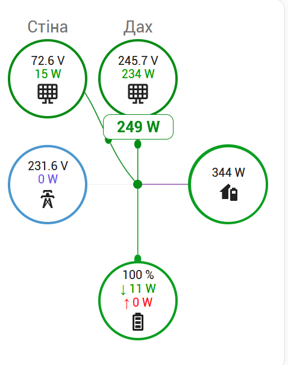
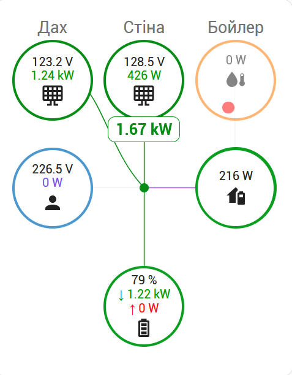
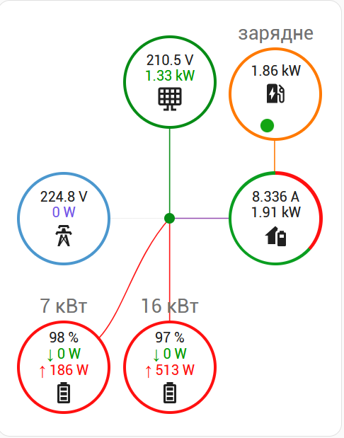

# Simple Power Flow Card

## Українська

SVG-картка потоків енергії для Home Assistant.

### Можливості

- Два сонячні входи
- Дві батареї
- До трьох мереж
- Два споживачі
- Нативний редактор
- Автоматичний Solar Total
- Активні анімовані потоки

### Напрямок батареї за замовченням

- Заряд: Центр → Батарея
- Розряд: Батарея → Центр

## English

SVG power flow card for Home Assistant.

### Features

- Dual solar
- Dual battery
- Native editor
- Animated flows
- Auto Solar Total
